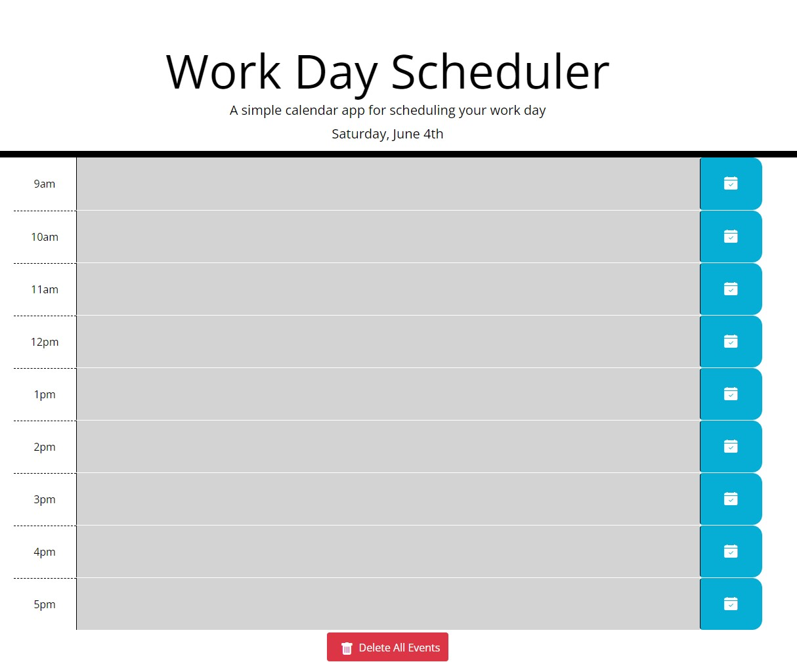

# 05 Third-Party APIs: Work Day Scheduler

## Description

In this project we had to create a page where it is a work day planner where the user can edit a text-area for each hour of the work day and click a button to save that event. We were provided a started HTML and CSS file that handled the majority of the styling and were required to write the necessary HTML, CSS, and JavaScript/jQuery to complete the application. The JavaScript/jQuery was written to build the schedule on the page and done so with a for loop to be dynamic and easily changed. In the HTML I added a button at the bottom that will delete all the events currently in the schedule. In the CSS I made minor styling changes to improve appearance. 

## User Story

```
AS AN employee with a busy schedule
I WANT to add important events to a daily planner
SO THAT I can manage my time effectively
```

## Acceptance Criteria

```
GIVEN I am using a daily planner to create a schedule
WHEN I open the planner
THEN the current day is displayed at the top of the calendar
WHEN I scroll down
THEN I am presented with timeblocks for standard business hours
WHEN I view the timeblocks for that day
THEN each timeblock is color coded to indicate whether it is in the past, present, or future
WHEN I click into a timeblock
THEN I can enter an event
WHEN I click the save button for that timeblock
THEN the text for that event is saved in local storage
WHEN I refresh the page
THEN the saved events persist
```

The following animation is the supplied demonstration of the application functionality:


## Product 

The deployed application can be found [here](https://cnohilly.github.io/work-day-scheduler/)

The following image is the finished application:


